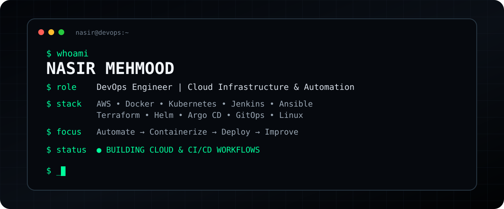
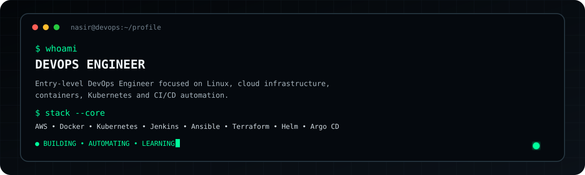
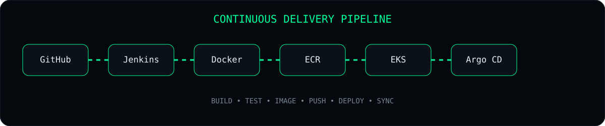
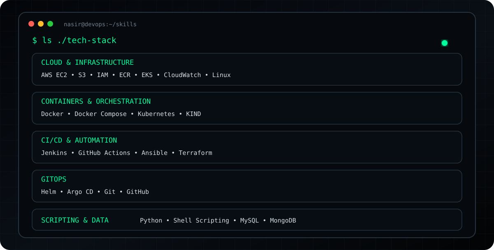
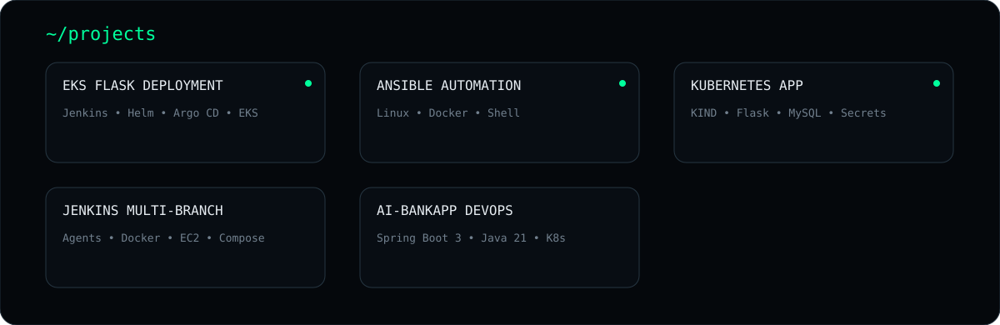
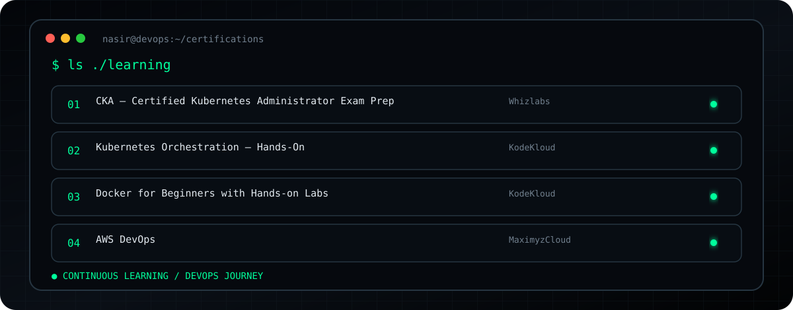
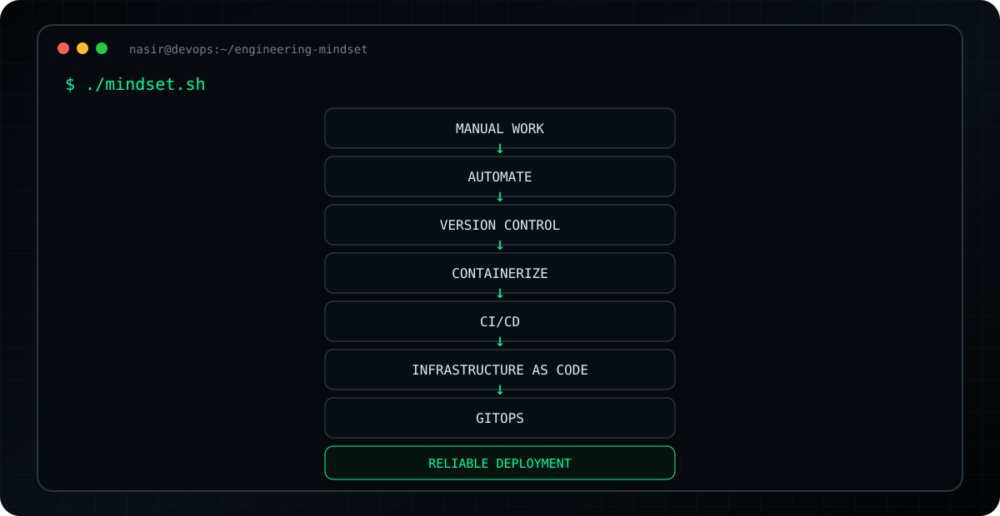
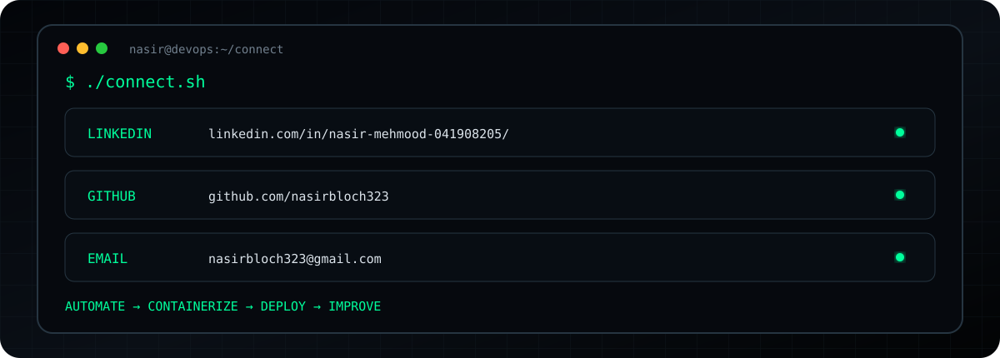

# 🖥️ NASIR MEHMOOD

### `DevOps Engineer | Cloud Infrastructure & Automation`

---

## 🖥️ `01 // WHOAMI`

---

## ⚙️ `02 // CI/CD PIPELINE`

---

## 🛠️ `03 // TECH STACK`

---

## 🚀 `04 // FEATURED PROJECTS`

---

## 📜 `05 // CERTIFICATIONS & LEARNING`

---

## 📊 `07 // ENGINEERING MINDSET`

---

## 🤝 `08 // CONNECT`

---

