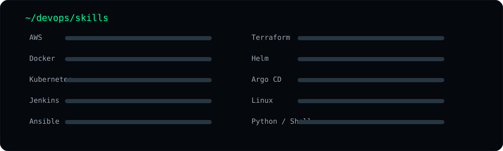

<div align="center">

# `NASIR MEHMOOD`

### `DevOps Engineer | Cloud Infrastructure & Automation`


<br/>

`AWS` `Docker` `Kubernetes` `Jenkins` `Ansible` `Terraform` `Helm` `Argo CD` `GitOps`

</div>

---

## 🖥️ `01 // WHOAMI`

> **Entry-level DevOps Engineer** focused on Linux, cloud infrastructure, containers, Kubernetes and CI/CD automation.

I build hands-on, production-style deployment workflows and continuously improve my skills in **AWS, Docker, Kubernetes, Jenkins, Ansible, Terraform, Helm and Argo CD**.

---

## ⚡ `02 // DEVOPS PIPELINE`


---

## 🛠️ `03 // TECH STACK`



### Cloud & Infrastructure
`AWS EC2` `S3` `IAM` `ECR` `EKS` `CloudWatch` `Linux`

### Containers & Orchestration
`Docker` `Docker Compose` `Kubernetes` `KIND`

### CI/CD & Automation
`Jenkins` `GitHub Actions` `Ansible` `Terraform`

### GitOps
`Helm` `Argo CD` `Git` `GitHub`

### Scripting & Data
`Python` `Shell Scripting` `MySQL` `MongoDB`

---

## 🚀 `04 // FEATURED PROJECTS`


### 🔥 End-to-End Flask App Deployment on AWS EKS
**Jenkins + Helm + Argo CD + Docker + AWS EKS**

CI with Jenkins, Kubernetes packaging with Helm, and GitOps-based continuous deployment with Argo CD.

### ⚙️ Server Configuration & Packaging with Ansible
**Ansible + Linux + Shell Scripting + Docker**

Automated server configuration and application packaging using repeatable Ansible playbooks.

### ☸️ Secure Two-Tier Flask Application
**Kubernetes + KIND + Docker + AWS EC2 + Flask + MySQL**

Deployed a Flask + MySQL application on Kubernetes with Kubernetes Secrets for credential management.

### 🔁 Multi-Branch Jenkins CI/CD Pipeline
**Jenkins + Jenkins Agents + Docker + AWS EC2 + Docker Compose**

Built a multi-branch pipeline that detects Git branches and deploys through Docker Compose.

### 🏦 AI-BankApp DevOps
**Spring Boot 3 + Java 21 + Docker + Docker Compose + Kubernetes**

Containerized and deployed a financial platform using Docker, Docker Compose and Kubernetes.

---

## 📜 `05 // CERTIFICATIONS & LEARNING`

- **CKA – Certified Kubernetes Administrator Exam Prep** — Whizlabs
- **Kubernetes Orchestration – Hands-On** — KodeKloud
- **Docker for Beginners with Hands-on Labs** — KodeKloud
- **AWS DevOps** — MaximyzCloud

---

## 🎯 `06 // CURRENT FOCUS`

```text
AWS Cloud             ████████████████████
Docker                ████████████████████
Kubernetes            ██████████████████░░
Jenkins / CI-CD       ██████████████████░░
Ansible               ████████████████░░░░
Terraform             ██████████████░░░░░░
Helm / Argo CD        ██████████████░░░░░░
```

---

## 📊 `07 // ENGINEERING MINDSET`

```text
Manual Work
    ↓
Automate
    ↓
Version Control
    ↓
Containerize
    ↓
CI/CD
    ↓
Infrastructure as Code
    ↓
GitOps
    ↓
Reliable Deployment
```

---

## 🤝 `08 // CONNECT`

**LinkedIn:** https://www.linkedin.com/in/nasir-mehmood-041908205/  
**GitHub:** https://github.com/nasirbloch323  
**Email:** nasirbloch323@gmail.com

<div align="center">

### `AUTOMATE → CONTAINERIZE → DEPLOY → IMPROVE`

</div>
